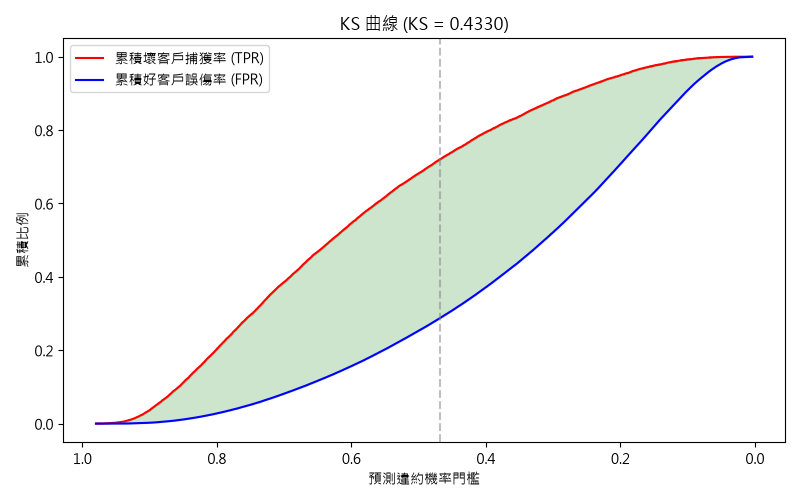
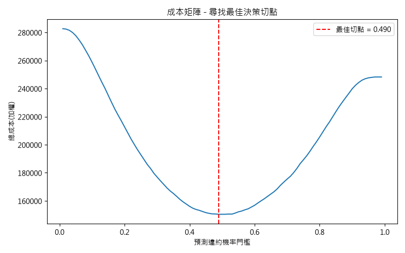
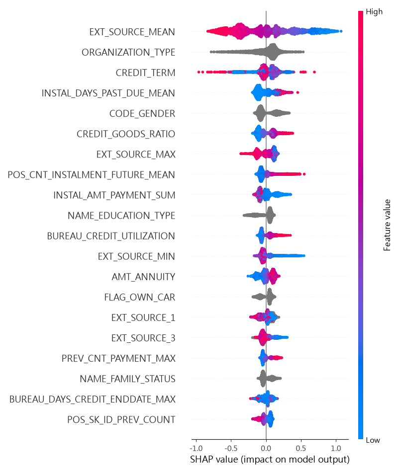
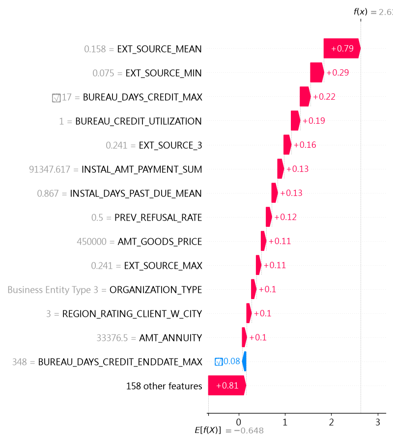

# 信用風險違約預測系統 (Credit Risk Default Prediction)

以 Kaggle **Home Credit Default Risk** 資料集為基礎，建立一套完整的信用風控機器學習流程——從資料清理、特徵工程、模型訓練調校，到金融風控指標評估與模型可解釋性分析，模擬銀行實務中「該不該核准這筆貸款」的完整決策鏈。

## 核心成果

| 指標 | 數值 | 說明 |
|---|---|---|
| **AUC (5-fold OOF)** | 0.7865 | LightGBM + Optuna 調參後 |
| **Gini 係數** | 0.573 | $2 \times AUC - 1$ |
| **KS 統計量** | 43.3 | 業界標準「良好」等級 (40-60) |
| **成本降低** | 39.4% | 相較「全部核准」，用成本矩陣找最佳決策切點後的加權成本降幅 |
| **風險分層鑑別力** | 1.4% → 20.6% | 最低風險 vs 最高風險 Tier 的實際違約率，相差近 15 倍 |

## 關鍵圖表

<table>
<tr>
<td width="50%">

**KS 曲線**（KS = 43.3，好壞客戶分離度最大處）



</td>
<td width="50%">

**成本矩陣最佳決策切點**（相較全部核准，成本降低 39.4%）



</td>
</tr>
<tr>
<td width="50%">

**SHAP 全局特徵重要性**（Top 20）



</td>
<td width="50%">

**SHAP 個體歸因範例**（拒貸理由拆解，預測違約機率 93.25%）



</td>
</tr>
</table>

## 專案背景

信用風控模型的核心任務,是在**核准貸款帶來的利息收入**與**違約造成的本金損失**之間找到最佳平衡點。這份專題模擬銀行實務流程,完整涵蓋:

1. 如何從破碎、高缺失、多來源的原始資料中萃取有意義的風險訊號
2. 如何用交叉驗證、超參數調校建立穩健的預測模型
3. 如何把模型輸出的機率,轉換成金融業實際使用的語言——KS 值、Gini、信用評分、風險分級
4. 如何用 SHAP 解釋模型決策,滿足風控/法遵對「可解釋性」的要求

## 資料集

[Home Credit Default Risk](https://www.kaggle.com/c/home-credit-default-risk)（Kaggle），包含 1 張主表與 5 張輔助表:

| 檔案 | 內容 | 列數 |
|---|---|---|
| `application_train/test.csv` | 客戶申請貸款當下的基本資料 | 307,511 / 48,744 |
| `bureau.csv` | 客戶在其他銀行的信貸紀錄 | 1,716,428 |
| `previous_application.csv` | 客戶過去在本公司的申貸歷史 | 1,670,214 |
| `installments_payments.csv` | 分期還款明細 | 13,605,401 |
| `POS_CASH_balance.csv` | 分期/現金貸款月結狀態 | 10,001,358 |
| `credit_card_balance.csv` | 信用卡月結單 | 3,840,312 |

## 方法流程

```
原始 8 張表
  → 記憶體優化 (reduce_mem_usage: downcast + category)
  → 缺失值 / 異常值清理 (DAYS_EMPLOYED 編碼錯誤、結構性缺失辨識)
  → 金融比率特徵工程 (負債比、年金收入比、EXT_SOURCE 聚合統計量)
  → 5 張附表 groupby 聚合 (逾期天數、額度使用率、過去拒貸率...)
  → 174 個特徵的完整訓練集
  → StratifiedKFold 5-fold 交叉驗證
  → Baseline: Logistic Regression (OOF AUC 0.768)
  → LightGBM (原生類別特徵 + scale_pos_weight 處理不平衡)
  → Optuna 貝氏優化超參數調校 (40 trials)
  → 最終模型 (OOF AUC 0.7865)
  → KS / Gini / 成本矩陣最佳切點 / 信用評分卡轉換 / 風險分級
  → SHAP 全局 + 個體可解釋性分析
```

## 專案結構

```
credit-risk-scoring-project/
├── data/                          # 原始與處理後資料 (不納入版控)
├── notebooks/
│   └── 01_eda.ipynb
├── src/
│   ├── utils.py                   # reduce_mem_usage 記憶體優化
│   ├── features.py                # 特徵工程函式庫 (清理、比率、附表聚合)
│   ├── build_features.py          # 完整特徵工程 pipeline (train/test 共用)
│   ├── train_baseline.py          # Logistic Regression baseline
│   ├── tune_optuna.py             # Optuna 超參數搜尋
│   ├── train_final.py             # 最終模型 5-fold 訓練
│   ├── risk_metrics.py            # KS / Gini / 成本矩陣 / 信用評分 / 風險分級
│   └── shap_analysis.py           # SHAP 全局與個體解釋
├── best_params.json               # Optuna 找到的最佳超參數
├── ks_curve.png / cost_curve.png / shap_summary.png / shap_waterfall_example.png
├── requirements.txt
└── README.md
```

## 如何重現

```bash
# 1. 建立環境
python -m venv .venv
.venv\Scripts\activate            # Windows
pip install -r requirements.txt

# 2. 下載資料集，放入 data/ 資料夾
#    (Kaggle: Home Credit Default Risk)

# 3. 執行完整 pipeline
python src/build_features.py      # 特徵工程 (train + test)
python src/train_baseline.py      # Baseline + LightGBM 預設參數
python src/tune_optuna.py         # 超參數調校 (約 1.5-3 小時)
python src/train_final.py         # 最終模型訓練
python src/risk_metrics.py        # 風控指標與視覺化
python src/shap_analysis.py       # 可解釋性分析
```

## 關鍵發現

- **特徵工程的邊際效益遠大於超參數調校**：LightGBM 使用預設參數即達到 AUC 0.784，Optuna 調參 40 次後僅再提升 0.0026，說明前期扎實的特徵工程（尤其是整併附表與 `EXT_SOURCE` 聚合）才是分數的主要來源。
- **線性相關係數會低估非線性特徵的重要性**：`CREDIT_TERM` 與 `TARGET` 的 Pearson 相關係數僅 -0.032，但在 SHAP 分析中卻是第三重要的特徵，證實樹模型能捕捉相關係數看不到的交互作用。
- **KS 最大化點與業務成本最小化點不一定重合**：兩者出發點不同（統計最佳分離 vs. 商業損失最小化），本專案的假設成本比例（違約:誤拒 = 10:1）恰好讓兩者接近，但這個切點會隨成本假設改變而移動，凸顯成本矩陣參數需要真實財務數據支撐，不能只看統計指標。
- **信用評分分級門檻不能套用教科書慣例值**：初版用固定分數門檻（650/580/500）切分，導致 Tier A 完全沒有客戶；改用分位數切分後才與實際分數分佈對齊，這是信用評分卡設計中容易忽略的細節。

## 已知限制與未來優化方向

- `ORGANIZATION_TYPE`（高基數類別特徵）在 SHAP 重要性排名第二，需要進一步檢查是否存在小樣本類別導致的過擬合，可用 target encoding smoothing 或稀有類別合併緩解。
- 目前只用 LightGBM 單一模型；可嘗試 XGBoost / CatBoost 做模型融合 (stacking/blending)。
- 成本矩陣的 10:1 權重為示範假設，未來可用真實貸款金額與違約損失率 (LGD) 反推更精確的成本結構。
- `bureau_balance.csv` 尚未整併，可再挖掘客戶歷史信貸的月度趨勢特徵。

## 技術棧

`Python` `pandas` `numpy` `scikit-learn` `LightGBM` `Optuna` `SHAP` `matplotlib`